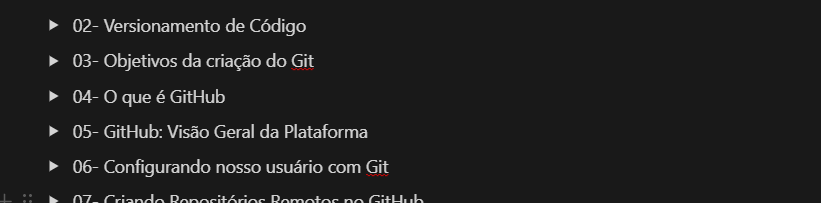

# Projeto com README
## Subtitulo
### Sub-SubTitulo


Imagem do Shaka com link do youtube

[](https://youtube.com)

✨Passada as fotos maneiras do Shaka, vamos mostrar um gif



## Tecnologias utilizadas

- HTML
- CSS
- JS

## Forma de Usar

```
git clone https://nome-usuario/nome-repositorio.git

```
